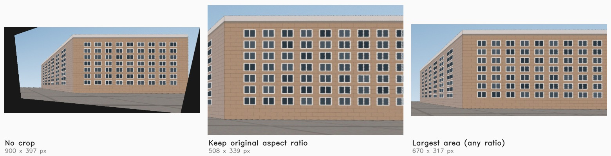
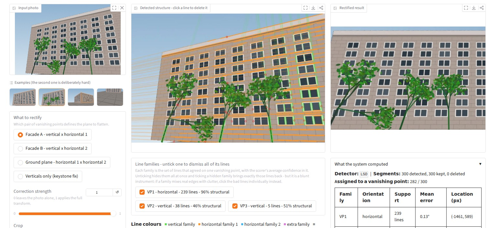

# Explainable Perspective Rectifier

*Serena Sun · 24-679 Special Topics: Designing and Prototyping AI Systems · Project 0*

**An interactive tool that corrects the perspective distortion in architectural
photographs — and shows you exactly why it made the choice it made, so you can
overrule it.**


---

## 1. What this is, and why I built it

Photograph a building from the pavement and the walls lean inward. Every photo
editor offers to fix this automatically, and the fix works — until it doesn't.
When it fails, it fails silently: you get a subtly bent building, no
explanation, and no way to intervene except to undo it and give up. The
decision the software made — *which edges in this photo represent the
building's real geometry?* — is invisible, even though it is the only decision
that matters.

This project turns that decision inside out. It detects the straight edges in a
photo, groups them into families that converge on a shared **vanishing point**,
draws all of it on the image, and then lets you **click any line you disagree
with to delete it** — or untick a whole family at once. The estimate recomputes
immediately. A tree branch that happens to line up with the roofline, a shadow,
a reflection in a window — the things that break automatic tools — become a
two-second correction instead of a dead end.

Because the geometry is fully exposed, the system can also report something
that ordinarily requires the camera's metadata: **the lens's focal length**,
recovered from nothing but the fact that a building's edges meet at right
angles. On the bundled examples it lands within 0.1–1.3% of the true value.

---

## 2. Quick start

You need Python 3.9 or newer. From a fresh clone:

```bash
git clone <this-repository-url>
cd perspective-rectifier

python -m venv .venv
source .venv/bin/activate          # Windows: .venv\Scripts\activate

pip install -r requirements.txt
python app.py
```

Then open the URL it prints — **http://127.0.0.1:7860** — in a browser. Click
one of the four example images to see it work; the second one (the building
with trees) is the interesting case.

**Using conda instead:**

```bash
conda env create -f environment.yml
conda activate perspective-rectifier
python app.py
```

**Verifying the install:**

```bash
pytest -q          # 45 tests, ~14 seconds
```

That is the whole setup. There are no model weights to download, no API keys,
no dataset, and no configuration file. The example images are generated by a
script in the repository and committed, so nothing is fetched at runtime.

Useful flags: `python app.py --port 8080` to change the port, `--share` to
create a temporary public link.

---

## 3. How to use it

1. **Pick an example, or upload your own photo.** Buildings shot from below or
   at an angle work best. Analysis runs automatically on upload.
2. **Read the middle panel.** Coloured lines are edges that agreed on a
   vanishing point — green for the vertical family, orange and blue for the
   horizontal ones. Grey lines agreed with nothing. The faint rays show where
   each family converges. Small red circles mark lines the learned scorer
   distrusts.
3. **Click a line to delete it.** It turns to a dashed dark-red line and the
   vanishing points, the rectified result, and the diagnostics all update.
   Click a deleted line again to bring it back.
4. **Untick a family** in the checkbox row beneath the overlay to dismiss every
   line that voted for one vanishing point in a single action. Each label
   carries the family's size and the scorer's average confidence in it, so a
   family made of tree trunks is visible as a number — `46% structural` next to
   a healthy family's `96%` — before you have gone looking for it. Ticking a
   hidden family restores exactly the lines it took away.
5. **Press "Auto-remove suspect lines"** once you have corrected a few by hand.
   The scorer will have learned from your clicks and applies the same judgement
   to the rest of the image.
6. **Choose what to rectify** with the radio buttons, pick a **crop** mode, and
   use the strength slider to blend between the original and the fully
   corrected version.
7. **Press "Render full resolution"** to save the result as a PNG or JPEG. The
   preview panel is deliberately small — see below — so this step re-warps your
   original upload at its native resolution rather than enlarging what is on
   screen.

The panel on the right, *What the system computed*, reports every internal
quantity: how many segments were found, how many voted for each vanishing
point, how far they miss it on average, where the horizon runs, the recovered
focal length, and which appearance cues the scorer is leaning on.

---

## 4. How it works

Four stages, plus a framing step. Each lives in its own module, and each is
drawn on screen rather than hidden.

### Stage 1 — Find candidate edges (`src/line_detection.py`)

OpenCV's Line Segment Detector extracts straight segments; segments shorter
than 2.5% of the image diagonal are discarded because their direction is
dominated by pixel noise, and the longest 300 survivors are kept. Each segment
is stored both as endpoints and as a homogeneous line `l = p₁ × p₂`, which is
what makes the next stage a few cross products.

The detector choice is defensive: LSD was removed from OpenCV between versions
4.1 and 4.7 over a patent dispute and restored in 4.8, so the module falls back
to `ximgproc`'s FastLineDetector and then to Canny + probabilistic Hough. All
three produce the same data structure.

### Stage 2 — Estimate vanishing points (`src/vanishing_points.py`)

Under a pinhole camera, parallel lines in the world project to image lines that
all pass through one point. So a vanishing point `v` satisfies `l · v = 0` for
every line in its family: two lines are enough to *propose* one (their cross
product), and many are needed to *verify* it. That is a RANSAC problem.

- **Propose.** Thousands of random line pairs at once, vectorised.
- **Score.** For each candidate, count the segments whose own direction is
  within a few degrees of pointing at it, weighted by segment length. The
  residual is deliberately *angular* rather than the algebraic `|l · v|`, which
  has no units and grows with how far the vanishing point happens to land from
  the origin — a single threshold on it would be meaningless.
- **Refine.** Re-fit the winner on all of its inliers by minimising
  `Σ wᵢ (lᵢ · v)²` subject to `‖v‖ = 1`, which is the smallest eigenvector of
  the weighted scatter matrix `Σ wᵢ lᵢ lᵢᵀ`.
- **Repeat.** Remove the inliers and run again, up to three times, because an
  architectural scene has up to three mutually perpendicular families.

The whole stage takes about 0.2 s for 300 segments, which is why the interface
can afford to re-run it on every single click.

### Stage 3 — Recover the camera, then rectify (`src/rectify.py`)

If two world directions are perpendicular, their vanishing points satisfy
`v₁ᵀ ω v₂ = 0`, where `ω` is the image of the absolute conic. Assuming what
essentially every consumer camera satisfies — square pixels, no skew, principal
point at the image centre — that constraint collapses to one equation in one
unknown:

```
(u₁ − c_x)(u₂ − c_x) + (v₁ − c_y)(v₂ − c_y) + f² = 0
```

so the focal length falls out as `f = √(−dot)`. A building gives up to three
perpendicular pairs; the median of the estimates is used.

With `f` in hand, rectification becomes a *camera rotation* rather than an
algebraic trick. Back-project two vanishing points to the 3D directions they
represent, `d = K⁻¹v`; build the rotation `R` whose rows are those directions
and their cross product; then

```
H = K · R · K⁻¹
```

is exactly the photograph you would have taken had the camera been turned to
face the plane square-on. Because `R` is a rotation, no shear or anisotropic
scale creeps in — **the rectified facade has the proportions of the real
wall.** When the focal length cannot be recovered, the code falls back to a
purely algebraic construction that still removes the perspective distortion but
leaves the aspect ratio undetermined; the interface says which one ran.

Four rectification targets are offered: either facade plane, the ground plane
(a top-down view), and a verticals-only keystone fix that straightens leaning
walls while leaving the framing alone.

### Framing the result (`src/crop.py`)

A projective map turns the rectangular frame into a quadrilateral, so any
rectangular canvas fitted around it has empty corners — and the stronger the
correction, the larger they get. They are geometrically honest (the camera
never saw those parts of the scene from the corrected viewpoint) but they make
a good result look broken.



So the output is cropped to the largest rectangle lying entirely inside the
region of real pixels. Content at the edges is lost; that is the trade and it
is the user's to make, so three modes are offered: **keep the original aspect
ratio** (the default — the result still looks like a photograph from the same
camera), **largest area at any ratio**, and **no crop**, which shows the raw
warp for anyone who wants to see what was thrown away.

Finding that rectangle exactly, with the largest-rectangle-in-a-histogram
algorithm, is a per-pixel stack loop costing a few hundred milliseconds in
Python — too slow for something that re-runs on every click. Two changes make
it about ten:

- **Search a downsampled mask.** The answer is smooth, so a 300-pixel-wide copy
  locates the rectangle to within a pixel or two. The result is mapped back up
  and verified against the full-resolution mask, shrinking slightly if the
  boundary was missed.
- **Fix the ratio and binary search the scale.** With the aspect ratio pinned,
  "does a *w* × *h* rectangle fit anywhere?" is one vectorised sliding-window
  sum over an integral image, with no Python loop at all — and eight of those
  bracket the largest size. Free-ratio mode sweeps 23 ratios through the same
  routine, which approximates the exact algorithm closely and stays fast.

The validity mask is built by warping a solid white image with the same
homography, not by testing the output for black pixels — otherwise a genuinely
dark doorway in the photograph would be mistaken for empty canvas.

### Preview versus export (`Session.export_full_resolution`)

Everything above runs on a copy of the photo downscaled to at most 1000 px, and
warps into a canvas of at most 900 px. That is the right trade for something
that re-estimates and re-renders on every click — a full recompute lands in
about 0.2 s — and completely the wrong one for a file you intend to keep. A
4000-pixel photograph would otherwise come back at roughly 700 px and visibly
soft.

So saving is a separate, deliberate step, and it re-warps the **original**
upload rather than enlarging the preview. Nothing is re-estimated. If `S` is
the downscaling that produced the analysis image and `H` the homography found
in that frame, a point of the original reaches the preview canvas by `H · S`,
so scaling that canvas up by `k` gives

```
H_export = diag(k, k, 1) · H · S
```

which warps the untouched original straight into a canvas `k` times the
preview's size; `k = 1/scale` restores the original pixel density. The crop
rectangle is scaled by the same factor instead of being searched again, so the
saved file is framed exactly like the preview you approved. Interpolation is
bicubic here rather than bilinear — the cost is paid once, not on every click.

On a 4000 × 2666 pixel input this turns a 725 × 486 preview into a 2896 × 1940
export, about **3.5× the high-frequency detail** of the same preview upscaled
to that size (variance of the Laplacian, 20.6 versus 5.8).

One related annoyance worth recording, since it is invisible until you try to
use the output: Gradio's built-in image download button defaults to **WebP**,
which several common image editors still refuse to open. Both image panels now
pass `format="png"` explicitly, and the export offers PNG or JPEG.

### Stage 4 — Learn which edges are structural (`src/features.py`, `src/suggest.py`)

Geometry alone has a blind spot. A branch can point at a vanishing point by
chance, and enough of them will win the vote outright. A person doesn't make
that mistake, because a person also looks at what the edge *is*: masonry edges
are high-contrast, locally isolated, and keep a consistent gradient direction
along their length; foliage edges sit in a thicket of other edges, are low in
contrast, and drift in colour.

So each segment gets a twelve-dimensional descriptor — length, orientation,
position, edge strength, gradient consistency, contrast across the edge and its
stability, greenness, saturation, local edge density, local texture — and a
logistic regression learns to map it to "is this structural?".

**The training labels are free.** They come from two sources:

1. **Self-supervision from geometry.** Segments that agree tightly with an
   estimated vanishing point become weak positives; segments that agree with
   nothing become weak negatives. Hundreds of them, and noisy by construction —
   a lucky branch gets labelled positive.
2. **The user's clicks.** Every deletion is a confident negative, every restore
   a confident positive. Few of them, so they carry eight times the weight.

The model refits on every click, in milliseconds. This is what makes the
interaction more than manual labour: **correct three branches and it offers to
remove the other thirty.** Its coefficients are shown in the diagnostics panel,
so you can see what it has decided matters.

---

## 5. Does it actually work?

Because the example images are rendered through an explicit pinhole camera
(`examples/make_examples.py`), the true vanishing points and focal length of
every scene are known in closed form and stored in
`examples/ground_truth.json`. The test suite checks against them rather than
against a screenshot.

| Example | Focal length recovered | True value | Error |
|---|---|---|---|
| `01_facade_clean` | 832 px | 833 px | 0.1% |
| `03_street_corner` | 822 px | 833 px | 1.3% |
| `04_plaza_ground` | 836 px | 833 px | 0.4% |

Recovered vanishing points are within 2° of the rendered ones on every clean
example, and rectified line families land within 2° of horizontal and vertical.

The foliage example is the one that matters, because it is the one that fails.
Before any pruning, the tree trunks have hijacked the vertical family and the
rectified result is visibly wrong:



After three clicks and one press of *Auto-remove suspect lines*, the same photo
rectifies cleanly and the recovered focal length lands on the true value:


| State | Vertical VP error | Focal length (true: 833 px) |
|---|---|---|
| As detected | **12.9°** | 751 px (−9.8%) |
| After 3 manual clicks on tree trunks | 13.1° | 741 px |
| … then one press of *Auto-remove* | **0.65°** | 834 px (+0.1%) |
| All visibly green lines pruned by hand | **0.19°** | 834 px |

Note the middle row: three clicks barely move the estimate on their own. What
they do is *teach the model*, and one bulk action then fixes everything. That
interplay — a few human corrections generalised by a model that retrains
instantly — is the point of the whole design.

---

## 6. Project structure

```
perspective-rectifier/
├── app.py                    ← START HERE. The Gradio interface; no CV code.
├── requirements.txt          Runtime dependencies (pip)
├── environment.yml           Same, for conda users
├── src/
│   ├── line_detection.py     Stage 1: segment detection, with fallbacks
│   ├── vanishing_points.py   Stage 2: sequential RANSAC + least-squares refit
│   ├── rectify.py            Stage 3: self-calibration and the homography
│   ├── crop.py               Largest inscribed rectangle; removes the border
│   ├── features.py           Per-segment appearance descriptors
│   ├── suggest.py            Stage 4: the self-supervised line scorer
│   ├── visualize.py          The clickable overlay and hit-testing
│   └── pipeline.py           Session state; wires the stages together
├── examples/
│   ├── make_examples.py      Renders the sample images from a pinhole camera
│   ├── ground_truth.json     True vanishing points and focal lengths
│   └── 0*.jpg                Four bundled scenes
├── tests/
│   └── test_pipeline.py      45 tests, checked against ground truth
└── docs/                     Screenshots used in this README
```

The split between `app.py` and `src/pipeline.py` is deliberate: `app.py` owns
widgets and knows nothing about geometry, `pipeline.py` owns state and knows
nothing about widgets. That is why the whole algorithm can be tested headlessly.

---

## 7. Honest limitations

- **It needs straight edges.** Brutalist concrete, glass curtain walls in flat
  light, and anything organic will not give the detector enough to work with.
- **The vertical family is fragile.** Vertical edges in a facade photo are
  usually shorter than horizontal ones (window sides versus window tops and
  brick courses), so the vertical family often has the least support — which is
  exactly why the foliage example fails the way it does.
- **Self-calibration assumes an ideal camera.** Square pixels, no skew,
  principal point dead centre. A cropped or heavily distorted image breaks
  those assumptions, and the code returns "not recoverable" rather than a wrong
  number when the arithmetic says the directions cannot be perpendicular.
- **Lens distortion is not modelled.** A wide-angle phone lens curves straight
  lines slightly; the detector then breaks one edge into several segments that
  disagree about the vanishing point.
- **The ground-plane mode only suits photos where the ground fills the frame.**
  In any other photo the walls stretch toward infinity, which is geometrically
  correct and visually useless. The interface says so when you select it.
- **The scorer is small on purpose.** Twelve features and a logistic regression
  fit to a few hundred noisy labels will not generalise across lighting or
  architectural styles the way a trained segmentation network would. It is a
  fast, interpretable assistant, not a perception system.
- **Cropping discards content, and cannot be undone from inside the result.**
  The default keeps the original aspect ratio, which costs more of the frame
  than a free-ratio crop would; "no crop" is there when you would rather see
  everything.
- **Dismissing a family is a blunt instrument.** It works when a family is
  wrong in its entirety. When one mixes real building edges with clutter —
  which is exactly what happens to the vertical family in the foliage example —
  unticking it throws the good lines out too, and clicking the bad lines
  individually does better. The interface says so, but it is a real limitation
  of grouping by vanishing point rather than by what the edge actually is.
- **Analysis happens at up to 1000 px**, even though the export is full
  resolution. Detection and vanishing-point estimation see the downscaled copy,
  so very fine or very short edges in a large photograph are never candidates
  in the first place. Raising the analysis resolution would find more of them
  at the cost of a slower click loop; the export path only fixes output
  sharpness, not what the estimator had to work with.

**What I would do next**, in order: use a segmentation model (Segment
Anything, as suggested in feedback on my proposal) to mask vegetation and sky
before detection, which would attack the foliage failure at its source rather
than after the fact; add a lens-distortion parameter to the calibration; and
let the user drag a vanishing point directly instead of only pruning lines.

---

## 8. Use of generative AI

I built this with a generative AI assistant (Claude, in Anthropic's Cowork
environment), and my role throughout was **director** rather than typist. I set
the concept and the interaction model, specified the flow the system should
follow, reviewed and tested what came back, found the limitations by actually
using the thing, and drove two further rounds of revision off what I found.
Being specific about the division of labour:

**What I directed.** The idea is mine and it did not change from my project
proposal: expose the geometry that automatic perspective tools hide, and make
the user's disagreement with it the primary control. I specified the flow —
detect edges, group them by vanishing point, draw all of it over the photo, let
a click on any line remove it and recompute — and every design decision that
followed sat with me. I picked Gradio over Streamlit because click-on-image
works natively there and my core interaction depends on it. I decided against
adding a segmentation model before the deadline, on the grounds that a
reproducible project that nails its core is worth more than an ambitious one
that a classmate cannot run. And I chose to ship synthetic examples with known
ground truth instead of downloaded photographs, which removed the licensing
question and, more usefully, turned "does this look about right?" into a test
with a number in it.

**What the assistant generated.** The bulk of the implementation across the
seven modules and the test suite; the example renderer; and the first draft of
this README. It also proposed two things that were not in my plan and that I
kept after checking they earned their place: recovering the camera's focal
length from the perpendicularity of the vanishing points — which upgraded the
rectification from "removes the distortion" to "preserves the wall's real
proportions" — and the self-supervised labelling scheme that lets the line
scorer train on the geometry stage's own verdicts instead of on labels I would
have had to produce by hand.

**What using it changed.** Two features exist because I ran the tool and
disliked what I saw, not because either was planned. The perspective warp left
large black wedges in the corners that made correct results look broken, so I
asked for a crop with the original aspect ratio kept by default and the choice
left to the user — that became `src/crop.py`. And deleting lines one at a time
was tedious when an entire family was wrong, so I asked whether the families
the system had already grouped and colour-coded could be toggled directly —
that became the family checkboxes.

A third round came from the same place. Once I started saving results I found
that the downloads arrived as WebP files my image editor would not open, and
that the saved image was noticeably soft — the preview is rendered small so it
can redraw on every click, and saving was handing back that small render. Both
are fixed: the download format is now explicit, and saving re-warps the
original upload at full resolution instead of enlarging the preview.

Testing the family control immediately exposed its own limitation. Dismissing
the vertical family in the foliage example makes the estimate *worse*, because
that family mixes tree trunks with genuine building edges and the toggle throws
out both. I decided to keep the feature, document the limitation in section 7,
and have the interface steer the user toward per-line clicks when a family is
mixed — rather than quietly ship a control that looks helpful and is not.

**What testing caught that reading would not have.** Several things here exist
because the first version was wrong and running it showed that. The synthetic
camera rendered every building upside down (a y-axis convention error, now
`FLIP_Y` in `examples/make_examples.py`). The line-length threshold was
originally 4% of the image diagonal, which filtered out nearly every vertical
window edge and left the vertical family with three supporting lines — only
measuring vanishing-point error against the known ground truth surfaced it, and
the threshold is now 2.5%. The first rectification fitted its canvas to the
whole warped image and put the facade in a corner surrounded by stretched sky.
A second "vertical" family was being fed into a horizontal slot and producing
nonsense homographies. Each fix is commented at the place it applies.

**How I verified it.** Every number in section 5 comes from
`tests/test_pipeline.py`, which compares against the closed-form ground truth
of the rendered scenes rather than against my impression of a screenshot. The
click interaction, the family toggles and the crop modes were each exercised in
a real browser, reading back what the page actually reported. Where a piece of
generated code could not be checked against a number, I checked it by reading
it — and the limitations in section 7 are the ones I could not engineer away.

---

## 9. References

The geometry here is standard, and all of it is in one book:

- R. Hartley and A. Zisserman, *Multiple View Geometry in Computer Vision*,
  2nd ed., Cambridge University Press, 2004. Chapter 2 (projective geometry
  and homographies), Chapter 8 (the absolute conic and calibration from
  vanishing points).
- R. G. von Gioi et al., "LSD: a Line Segment Detector," *Image Processing On
  Line*, 2012.
- M. A. Fischler and R. C. Bolles, "Random Sample Consensus," *Communications
  of the ACM*, 1981.
